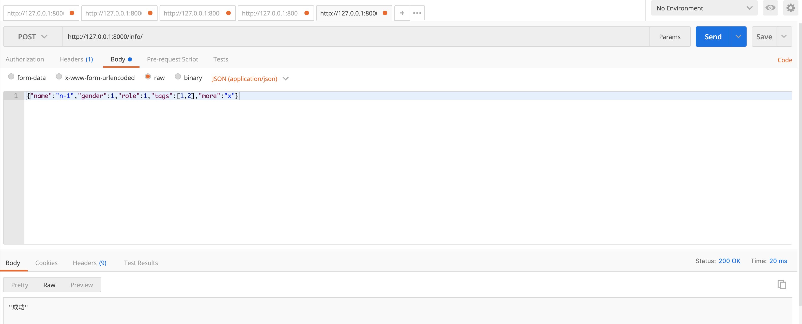

# DjangoRestframework

- 项目部署

- 前后端分离

  - 程序角度：1个django程序，接收请求+处理+HTML模板+用户返回
  - 2个程序
    - 前端：vue.js/react.js/angular.js
    - 后端：django + django restframework

  - 专业度角度：
    - 前端 前端代码 + 部署 + 版本管理 + ajax请求获取
    - 后端 API 

  

APP 或 微信小程序

- 前端：APP或微信小程序
- 后端：API


## Restframework


### 官方文档

[Home - Django REST framework (django-rest-framework.org)](https://www.django-rest-framework.org/)


### 安装

```bash
pip install djangorestframework
```

### 注册

settings.py

```python
INSTALLED_APPS = [
    "rest_framework"
]
```


## 接口调试工具

postman

apifox


## 初步编写API

- 基于django实现

- 基于drf实现

  

### 路由

```python
path('auth/', views.auth),
```


### 视图

```python
def auth(request):
    return JsonResponse({'status': True, 'message': "success"})
```


## FBV 和 CBV

- 现象
- 本质相同


**POST请求 免除CSRF token校验**

```python
@csrf_exempt
def info(request):
	pass
```


## CBV -> (DRF) -> dispath

```python
path('user/<int:pk>', views.UserView.as_view())

def get(self, request, pk):
```

- 请求对象和参数

  django的request对象

  ​	request.method

  ​	request.GET

  ​	request.POST

​	drf 中的 request 参数，又一层封装

​			# request._request.GET

​			# request._request.POST

​			# request._request.method

​	class Request:

​			def \__init__(self, request,......):

​					self._request = request

​					self.....


## 前后端分离

- 不分离
  - 后台系统 & 用户量少
- 前后端分离
  - 用户系统 & 专业分工


## restframework匿名用户报错

> django 纯净版

```python
# 源码 restframework request.py 中 
def _not_authenticated(self):
    if api_settings.UNAUTHENTICATED_USER:
        self.user = api_settings.UNAUTHENTICATED_USER()
    else:
        self.user = None
```

> 解决

settings.py

```python
REST_FRAMEWORK = {
    "UNAUTHENTICATED_USER": None,
    # "UNAUTHENTICATED_TOKEN": None,
}

```


## Request 对象

- OOP知识

```python
对象的封装
class Foo(object):
    def __init__(self, name, age):
        self.name = name
        self.age = age
        
    # 当通过对象访问一个不存在的东西，getattr会执行
    def __getattr__(self, item):
        print(item)
		return 123
    
    # 只要执行 对象.xxx都会执行 __getattribute__
    # 对象中有值，返回
    # 对象中没有值，报错
    def __getattribute__(self, item):
        print("-->", item)
        return 999
    
    # drf中request方法
    # 对象中有的成员，不会触发
    # 对象中无的成员，会触发
    def __getattr__(self, attr):
        # attr = "yyy"
        try:
            return getattr(self._request, attr) # self._request.yyy
        except AttributeError:
            return self.__getattribute__(attr)
```


- drf请求流程
  - *args, **kwargs


## 认证组件

- 用户授权
  - 无需登录访问
  - 登录才能访问
  - 实现
    - 编写类 —> 认证组件
    - 应用组件


全局配置用户授权

```python
REST_FRAMEWORK = {
    "DEFAULT_AUTHENTICATION_CLASSES":["app名称.views.类名"]
}
```


- 面向对象-继承

  ```python
  class APIView(object):
      authentication_classes = 读取配置文件中的列表
      
      def dispatch(self):
          self.authentication_classes
  
  class UserView(APIView):
      authentication_classes = [11,22,33,44]
          
  obj = UserView()
  obj.dispatch()
  ```

  

- 认证组件源码
  - 加载认证组件，本质就是实例化每个认证类的对象，并封装到request对象。

- 多个认证类
  - 都返回None，都没有认证成功 -> 视图函数会执行，只不过 self.user  self.auth = None


- 状态码

```python
class MyAuthentication(BaseAuthentication):

    def authenticate_header(self, request):
        return "API"
```


- 扩展 -> 子类的约束

```python
class Foo(object):
    # 对子类进行约束，约束子类中必须要定义这个方法。（接口、抽象类和抽象方法）
    def f1(self):
        raise NotImplementedError("...")
```


## 权限组件

认证组件 = [认证类、认证类、认证类]  -> 执行每个认证类中的authenticate方法

权限组件 = [权限类、权限类、权限类...] -> 执行每个权限类中的has_permission方法  执行所有的权限类

默认情况下，保证所有的权限类中的has_permission方法都返回True


**源码**

```python
class APIView(View):
    def initial(self, request, *args, **kwargs):
        self.perform_authentication(request) # 认证组件的过程，循环执行每个authticate方法，失败抛出异常：request.user/auth
        self.check_permissions(request) # 权限的校验
        self.check_throttles(request)
```


应用

- 类
- 应用（局部+全局应用）


应用场景

- 经典角色、当前订单是他的下属创建的


**drf中的认证、权限组件 与 Django中的中间件有什么关系？**

```python
# 先经过中间件 然后进行认证、权限组件
# 闭包中的view(免除csrf)
1.创建CBV的视图对象
2.执行对象dispatch
	2.1请求封装
    2.2认证
    2.3权限处理
```


## 限流

某个接口不想让用户访问过于频繁，限流机制。例如：手机号限制、平台请求、iP

限制访问频率：

- 已登录用户，用户信息主键、ID、用户名
- IP为唯一标识 + 算法JS

如何限制？

- 一定时间内，访问次数
- 获取当前时间
- 当前时间 - 10分钟 = 计数开始时间
- 计算长度
  - 超过，错误
  - 未超，访问


使用：

- 编写类
  - 编写类
  - 安装 django-redis配置 -> settings.py
  - 安装 django-redis
  - 启动redis服务
- 应用类
  - 局部应用


源码和具体实现：

- 对象加载
  - 获取每个限流类的对象，初始化（读取限制的配置，获取到 时间间隔 + 访问次数）--> num_requests, duration
- allow_request是否限流


### 案例：用户登录+用户认证+角色+扩展案例+限流

- 无需登录，限流  1分钟 10次


限流自定义错误提示

拆分知识点

- getattr
- getatrribute
- 继承

request 封装 + 认证 + 权限 + 限流 => 文章 + 流程图

<<<<<<< HEAD


## 解析器

解析请求者发送过来的数据 JSON

1. 读取请求头
2. 根据请求头解析数据
   1. 根据请求头获取解析器
   2. request.data = JSON解析器.parse
3. request.data


**json.loads 与 json.load 区别**

```python
data_dict = json.loads('{"v1":123, "v2":345}')

data_dict = json.load(文件对象)
```


###  JSONParser （*）


### FormParser


### MultiPartParser（*）


```html
<!DOCTYPE html>
<html lang="en">
<head>
    <meta charset="UTF-8">
    <title>Title</title>
</head>
<body>
<form action="http://127.0.0.1:8000/test/" method="post" enctype="multipart/form-data">
    <input type="text" name="user" />
    <input type="file" name="img">

    <input type="submit" value="提交">

</form>
</body>
</html>
```


### FileUploadParser（*）


解析器可以设置多个，默认解析器：

```python
from rest_framework.views import APIView
from rest_framework.response import Response
from rest_framework.parsers import MultiPartParser, JSONParser, FormParser

class UserView(APIView):

    def post(self, request):
        print(request.content_type)
        print(request.data)

        return Response("...")

```

 

### 数据

文件二进制读取

- Tempa 对象
- Tempa 对象 -> 临时文件


## 元类

```python
# 创建类：方式2
# 类名 = type("类名", (父类,), {成员})
Foo = type("Foo", (object,), {"v1":123, "func": lamba self: 999})


object,所有类的基类（公共功能，都写在这里面）
class Foo(object):
    pass

obj = Foo()
v1 = obj.__str__() #<__main__.Foo object at Ox12xxx>
print(v1)
```

- 基于类可以实例化对象。

- type也可以创建类。

  - 默认 type

    ```python
    class type:
        def __init__(self):
            在空值初始化数据
        def __new__(self):
            创建->创建类
    ```

  - 自定义 继承type

    ```python
    class MyType(type):
        def __new__(self):
            super().__new__()
    ```

- 如何基于MyType创建类呢？

- 类中获取父类中指定了metaclass，全部都是有metaclass创建的类

  

## 序列化器

从数据库获取QuerySet或数据对象 —> JSON

- **序列化器**，将ORM获取的数据库QuerySet或数据对象**序列化**成JSON格式 + **请求数据格式校验**。（最重要）

- 分页，对ORM中获取的数据进行分页处理，分批返回给用户。

- 视图，drf中提供了APIView+其他视图类让我们来继承。

- 路由，配合视图快速生成增删改查相关的路由+视图关系。

- 条件筛选，编写API搜索。

  

### 序列化数据

#### Serializer

```python
from django.db import models


class Role(models.Model):
    title = models.CharField(verbose_name="标题", max_length=32)
    order = models.IntegerField(verbose_name="顺序")
```

```python
from rest_framework.views import APIView
from rest_framework.response import Response
from rest_framework import serializers
from api import models


class InfoSerializer(serializers.Serializer):
    id = serializers.IntegerField()
    title = serializers.CharField()
    order = serializers.IntegerField()


class InfoView(APIView):
    def get(self, request):
        # 1.数据库获取多条数据
        # queryset = models.Role.objects.all()
        # ser = InfoSerializer(instance=queryset, many=True)

        # 2.数据库获取单条数据
        instance = models.Role.objects.all().first()
        ser = InfoSerializer(instance=instance, many=False)
        
        print(type(ser.data), ser.data)
        return Response(ser.data)

```


#### ModelSerializer

```python
from django.db import models


class Role(models.Model):
    title = models.CharField(verbose_name="标题", max_length=32)
    order = models.IntegerField(verbose_name="顺序")
```

```python
from rest_framework.views import APIView
from rest_framework.response import Response
from rest_framework import serializers
from api import models


class InfoSerializer(serializers.ModelSerializer):
    class Meta:
        model = models.Role
        # fields = "__all__"
        # fields = ['id', 'title', 'order']
        exclude = ["id"]


class InfoView(APIView):
    def get(self, request):
        # 1.数据库获取多条数据
        # queryset = models.Role.objects.all()
        # ser = InfoSerializer(instance=queryset, many=True)

        # 2.数据库获取单条数据
        instance = models.Role.objects.all().first()
        ser = InfoSerializer(instance=instance, many=False)

        print(type(ser.data), ser.data)
        return Response(ser.data)
```

很显然，如果要对数据表中的字段进行序列化，使用ModelModelSerializer是要比Serializer更简洁一些的。


#### 字段和参数

在`ModelModelSerializer`和`Serializer`中都可以自定义字段，并传入一些相关参数。

```python
from django.db import models


class Role(models.Model):
    title = models.CharField(verbose_name="标题", max_length=32)
    order = models.IntegerField(verbose_name="顺序")


class UserInfo(models.Model):
    name = models.CharField(verbose_name="姓名", max_length=32)
    gender = models.SmallIntegerField(verbose_name="性别", choices=((1, "男"), (2, "女")))
    role = models.ForeignKey(verbose_name="角色", to="Role", on_delete=models.CASCADE)
    ctime = models.DateTimeField(verbose_name="创建时间", auto_now_add=True)
```

```python
from rest_framework.views import APIView
from rest_framework.response import Response
from rest_framework import serializers
from api import models

class InfoSerializer(serializers.ModelSerializer):
    gender = serializers.CharField(source="get_gender_display")
    role = serializers.CharField(source="role.title")
    ctime = serializers.DateTimeField(format="%Y-%m-%d")
    other_name = serializers.CharField(source="name")
    mine = serializers.SerializerMethodField()

    class Meta:
        model = models.UserInfo
        fields = ['id', 'name', 'gender', "role", 'ctime', "other_name", "mine"]
    
    def get_mine(self, obj):
        return "x-x-{}".format(obj.name)

class InfoView(APIView):
    def get(self, request):
        queryset = models.UserInfo.objects.all()
        ser = InfoSerializer(instance=queryset, many=True)
        print(type(ser.data), ser.data)
        return Response(ser.data)
```


#### 3.1.6 底层实现原理（扩展）

声明：掌握上述知识点，已经可以让你完成工作中常见的任务。接下来的知识点，只是作为扩展，可以略过。

##### 1.元类

对象是通过类实例化出来的。

```python
class Foo(object):
    pass

# 第1步：调用Foo的__new__方法创建空对象。
# 第2步：调用Foo的__init__方法对对象进行初始化。
obj = Foo()
```


类是谁创建的？是由type创建出来的（默认）。

```python
class Foo(object):
    v1 = 123
    
    def func(self):
        return 666
```

```python
Foo = type("Foo",(object,),{ "v1":123, "func":lambda self:666 })
```


定义类时加入metaclass指定当前类的创造者。

```python
# 由type创建Foo类型
class Foo(object):
    pass
```

```python
# 由`东西` 创建Foo类型
class Foo(object,metaclass=东西):
    pass
```


指定元类(metaclass) 来创建类。

```python
class MyType(type):
    def __new__(cls, *args, **kwargs):
        new_cls = super().__new__(cls, *args, **kwargs)
        print("创建类：", new_cls)
        return new_cls

class Foo(metaclass=MyType):
    pass
```

```python
class MyType(type):
    def __init__(self, *args, **kwargs):
        print("第2步：初始化类成员：", args, **kwargs)
        super().__init__(*args, **kwargs)

    def __new__(cls, *args, **kwargs):
        new_cls = super().__new__(cls, *args, **kwargs)
        print("第1步：创建类：", new_cls)
        return new_cls


class Foo(metaclass=MyType):
    v1 = 123

    def func(self):
        pass
```

```python
class MyType(type):
    def __init__(cls, *args, **kwargs):
        print("第2步：初始化类成员：", args, **kwargs)
        super().__init__(*args, **kwargs)

    def __new__(cls, *args, **kwargs):
        new_cls = super().__new__(cls, *args, **kwargs)
        print("第1步：创建类：", new_cls)
        return new_cls

    def __call__(cls, *args, **kwargs):
        print("第3步：创建对象&初始化对象", cls)

        # 1.调用自己那个类的 __new__ 方法去创建对象
        new_object = cls.__new__(cls, *args, **kwargs)

        # 2.调用你自己那个类 __init__放发去初始化
        cls.__init__(new_object, *args, **kwargs)
        return new_object


class Foo(metaclass=MyType):
    v1 = 123

    def func(self):
        pass


obj = Foo()
```

##### 2.实例化字段对象

```python
from rest_framework.views import APIView
from rest_framework.response import Response
from rest_framework import serializers
from api import models


class InfoSerializer(serializers.Serializer):
    id = serializers.IntegerField()
    title = serializers.CharField()
    order = serializers.IntegerField
```

对于上述代码，在类`InfoSerializer`创建之前，其内部`id、title、order`字段会先进行实例化对象。

而这些`IntegerField`、`CharField`等字段的继承关系如下：

```python
class Field:
    _creation_counter = 0
    
class IntegerField(Field):
    pass

class CharField(Field):
    pass

class DateTimeField(Field):
    pass
```


在`IntegerField`、`CharField`等字段实例化时，内部会维护一个计数器，来表示实例化的先后顺序。

```python
class Field:
    _creation_counter = 0
	def __init__(self, *, read_only=False...):
        self._creation_counter = Field._creation_counter
        Field._creation_counter += 1
        
class IntegerField(Field):
	def __init__(self, **kwargs):
        ...
        super().__init__(**kwargs)

class CharField(Field):
	def __init__(self, **kwargs):
        ...
        super().__init__(**kwargs)
```

```python
from rest_framework.views import APIView
from rest_framework.response import Response
from rest_framework import serializers
from api import models


class InfoSerializer(serializers.Serializer):
    id = serializers.IntegerField()  # 对象，内部_creation_counter=0
    title = serializers.CharField()  # 对象，内部_creation_counter=1
    order = serializers.IntegerField # 对象，内部_creation_counter=2
```

注意：后续会通过这个计数器排序，以此来实现字段的先后执行。


**3.序列化类的创建**

```python
class SerializerMetaclass(type):
	def __new__(cls, name, bases, attrs):
        attrs['_declared_fields'] = cls._get_declared_fields(bases, attrs)
        return super().__new__(cls, name, bases, attrs)
```

```python
class Serializer(BaseSerializer, metaclass=SerializerMetaclass):
	...

class ModelSerializer(Serializer):
	...
    
class RoleSerializer(serializers.ModelSerializer):
    gender = serializers.CharField(source="get_gender_display")
    class Meta:
        model = models.Role
        fields = ["id", 'title',"gender"]
```

注意：父类中指定metaclass，子类也会由此metaclass来创建类。


##### 4._declared_fields

在创建类之前，元类的`__new__`方法在类成员中添加了一个`_declared_fields`（类变量）。

```python
class SerializerMetaclass(type):
    @classmethod
    def _get_declared_fields(cls, bases, attrs):
        # 1.循环获取类中定义所有的成员（类变量、方法），筛选出继承自Fields的类的字段对象。
        # 注意：同时会将字段在当前类成员中移除
        fields = [
            (field_name, attrs.pop(field_name)) 
            for field_name, obj in list(attrs.items())
            if isinstance(obj, Field)
        ]
        # 2.根据字段的_creation_counter排序
        fields.sort(key=lambda x: x[1]._creation_counter)

        # Ensures a base class field doesn't override cls attrs, and maintains
        # field precedence when inheriting multiple parents. e.g. if there is a
        # class C(A, B), and A and B both define 'field', use 'field' from A.
        known = set(attrs)

        def visit(name):
            known.add(name)
            return name
		
        # 3.读取父类中的_declared_fields字段（父类先于子类创建、序列化类支持继承）
        base_fields = [
            (visit(name), f)
            for base in bases if hasattr(base, '_declared_fields')
            for name, f in base._declared_fields.items() if name not in known
        ]
		
        # 4.将父类和子类中的字段打包返回，赋值给当前类的_declared_fields
        return OrderedDict(base_fields + fields)

    def __new__(cls, name, bases, attrs):
        attrs['_declared_fields'] = cls._get_declared_fields(bases, attrs)
        return super().__new__(cls, name, bases, attrs)
```

```python
class Serializer(BaseSerializer, metaclass=SerializerMetaclass):
	...

class ModelSerializer(Serializer):
	...
    
class RoleSerializer(serializers.ModelSerializer):
    gender = serializers.CharField(source="get_gender_display")
    class Meta:
        model = models.Role
        fields = ["id", 'title',"gender"]
```

所以，当类序列化类加载完毕后，类中成员：

- 剔除，字段对象。

  ```python
  RoleSerializer.gender   不存在
  ```

- 新增，_declared_fields，是`OrderedDict`类型且内部包含所有字段。

  ```python
  RoleSerializer._declared_fields = {
      "gender": CharField对象
  }
  ```

- 其他，保留原样。

  ```python
  RoleSerializer.Meta
  ```

  

##### 5.创建序列化类对象

在视图的方法，使用序列化类对 orm 获取的QuerySet或对象进行序列化时，需要先进行初始化类的对象。

```python
class SerializerMetaclass(type):
	def __new__(cls, name, bases, attrs):
        attrs['_declared_fields'] = cls._get_declared_fields(bases, attrs)
        return super().__new__(cls, name, bases, attrs)
```

```python
class BaseSerializer(Field):
    def __init__(self, instance=None, data=empty, **kwargs):
        self.instance = instance
        if data is not empty:
            self.initial_data = data
        self.partial = kwargs.pop('partial', False)
        self._context = kwargs.pop('context', {})
        kwargs.pop('many', None)
        super().__init__(**kwargs)

    def __new__(cls, *args, **kwargs):
        if kwargs.pop('many', False):
            # 调用 many_init 方法获取其他对象，返回
            return cls.many_init(*args, **kwargs)

        # 创建当前类的空对象，返回
        return super().__new__(cls, *args, **kwargs)


    @classmethod
    def many_init(cls, *args, **kwargs):
		...
        child_serializer = cls(*args, **kwargs)
        list_kwargs = {
            'child': child_serializer,
        }
        meta = getattr(cls, 'Meta', None)
        list_serializer_class = getattr(meta, 'list_serializer_class', ListSerializer)
        return list_serializer_class(*args, **list_kwargs)
    
class Serializer(BaseSerializer, metaclass=SerializerMetaclass):
	...

class ModelSerializer(Serializer):
	...
    
class RoleSerializer(serializers.ModelSerializer):
    gender = serializers.CharField(source="get_gender_display")
    class Meta:
        model = models.Role
        fields = ["id", 'title',"gender"]
```

```python
instance = models.UserInfo.objects.all().first()

# 实例化对象，内部会：先执行__new__、再执行__init__
# 第1步：__new__
# 	默认：many=True，返回ListSerializer对象； many=False，返回当前类InfoSerializer的对象。
# 第2步：__init__
#   此处就要根据__new__返回的不同对象，执行不同对象的__init__方法。
# =====> 思考题：你觉得他为什么要这么设计？ <======
ser = InfoSerializer(instance=instance, many=False)

# 获取序列化后的值
ser.data
```

##### 6.序列化-当前类

```python
class Field:
    def get_attribute(self, instance):
        # source_attrs=[]  或 source_attrs=["xx","xx","xxx"]
		return get_attribute(instance, self.source_attrs)
    
class CharField(Field):
    def to_representation(self, value):
        return str(value)
```

```python
class BaseSerializer(Field):
    @property
    def data(self):
        # 第2步
        if not hasattr(self, '_data'):
            if self.instance is not None and not getattr(self, '_errors', None):
                # 第3步：用于序列化给对象进行初始化用的。
                self._data = self.to_representation(self.instance)
            elif hasattr(self, '_validated_data') and not getattr(self, '_errors', None):
                # 这里是用于对请求校验时，才触发执行的。
                self._data = self.to_representation(self.validated_data)
            else:
                # 这个是用于给Serializer，不传对象而传入initial_data参数用的。
                self._data = self.get_initial()
        return self._data

class Serializer(BaseSerializer, metaclass=SerializerMetaclass):
    @property
    def data(self):
        # 第1步
        ret = super().data
        return ReturnDict(ret, serializer=self)
	
    def to_representation(self, instance):
        # 第4步
        ret = OrderedDict()
        
        # 第5步：获取 _declared_fields 中所有非write_only字段，即：用于序列化的字段。
        #       如果是ModelSerializer，也会去寻找其Meta中定义的字段 + 字段的bind方法
        fields = self._readable_fields

        for field in fields:
            try:
                # 第5步：调用字段对象中的 get_attribute 方法
                attribute = field.get_attribute(instance)
            except SkipField:
                continue

            check_for_none = attribute.pk if isinstance(attribute, PKOnlyObject) else attribute
            if check_for_none is None:
                ret[field.field_name] = None
            else:
                # 第6步：调用字段对象中的 to_representation 方法
                ret[field.field_name] = field.to_representation(attribute)

        return ret
    
class ModelSerializer(Serializer):
	...
    
class RoleSerializer(serializers.ModelSerializer):
    gender = serializers.CharField(source="get_gender_display")
    class Meta:
        model = models.Role
        fields = ["id", 'title',"gender"]
```

```python
instance = models.UserInfo.objects.all().first()
ser = InfoSerializer(instance=instance, many=False)

# 创建InfoSerializer类的对象，获取序列化后的值
ser.data
```


**7.序列化-ListSerializer**

```python
class BaseSerializer(Field):
    @property
    def data(self):
        if not hasattr(self, '_data'):
            if self.instance is not None and not getattr(self, '_errors', None):
                # 这里
                self._data = self.to_representation(self.instance)
            elif hasattr(self, '_validated_data') and not getattr(self, '_errors', None):
                self._data = self.to_representation(self.validated_data)
            else:
                self._data = self.get_initial()
        return self._data

class ListSerializer(BaseSerializer):
	@property
    def data(self):
        ret = super().data
        return ReturnList(ret, serializer=self)
    
    def to_representation(self, data):
        iterable = data.all() if isinstance(data, models.Manager) else data
        
        return [
            # 循环，利用序列化类去处理每个对象
            self.child.to_representation(item) for item in iterable
        ]

```


### 3.2 数据校验

对用户发来的请求数据进行校验。


#### 3.2.1 内置校验

```python
from rest_framework.views import APIView
from rest_framework.response import Response
from rest_framework import serializers


class InfoSerializer(serializers.Serializer):
    title = serializers.CharField(required=True, max_length=20, min_length=6)
    order = serializers.IntegerField(required=False, max_value=100, min_value=10)
    level = serializers.ChoiceField(choices=[("1", "高级"), (2, "中级")])


class InfoView(APIView):
    def post(self, request):
        ser = InfoSerializer(data=request.data)
        if ser.is_valid():
            return Response(ser.validated_data)
        else:
            return Response(ser.errors)
```

#### 3.2.2 正则校验

```python
from rest_framework.views import APIView
from rest_framework.response import Response
from rest_framework import serializers
from django.core.validators import RegexValidator, EmailValidator


class InfoSerializer(serializers.Serializer):
    title = serializers.CharField(required=True, max_length=20, min_length=6)
    order = serializers.IntegerField(required=False, max_value=100, min_value=10)
    level = serializers.ChoiceField(choices=[("1", "高级"), (2, "中级")])

    # email = serializers.EmailField()
    email = serializers.CharField(validators=[EmailValidator(message="邮箱格式错误")])

    more = serializers.CharField(validators=[RegexValidator(r"\d+", message="格式错误")])

    code = serializers.CharField()
```


#### 3.2.3 钩子校验

```python
from rest_framework.views import APIView
from rest_framework.response import Response
from rest_framework import serializers
from rest_framework import exceptions


class InfoSerializer(serializers.Serializer):
    title = serializers.CharField(required=True, max_length=20, min_length=6)
    order = serializers.IntegerField(required=False, max_value=100, min_value=10)
    code = serializers.CharField()

    def validate_code(self, value):
        print(value)
        if len(value) > 6:
            raise exceptions.ValidationError("字段钩子校验失败")
        return value

    def validate(self, attrs):
        print("validate=", attrs)
        # api_settings.NON_FIELD_ERRORS_KEY
        # raise exceptions.ValidationError("全局钩子校验失败")
        return attrs


class InfoView(APIView):
    def post(self, request):
        ser = InfoSerializer(data=request.data)
        if ser.is_valid():
            return Response(ser.validated_data)
        else:
            return Response(ser.errors)
```


#### 3.2.4 Model校验

```python
from rest_framework.views import APIView
from rest_framework.response import Response
from rest_framework import serializers
from rest_framework import exceptions
from api import models
from django.core.validators import RegexValidator


class RoleSerializer(serializers.ModelSerializer):
    more = serializers.CharField(required=True)

    class Meta:
        model = models.Role
        fields = ["title", "order", "more"]
        extra_kwargs = {
            "title": {"validators": [RegexValidator(r"\d+", message="格式错误")]},
            "order": {"min_value": 5},
        }

    def validate_more(self, value):
        return value

    def validate(self, attrs):
        return attrs


class InfoView(APIView):
    def post(self, request):
        ser = RoleSerializer(data=request.data)
        if ser.is_valid():
            return Response(ser.validated_data)
        else:
            return Response(ser.errors)
```


#### 3.2.5 校验+保存

```python
from rest_framework.views import APIView
from rest_framework.response import Response
from rest_framework import serializers
from rest_framework import exceptions
from api import models
from django.core.validators import RegexValidator


class RoleSerializer(serializers.ModelSerializer):
    more = serializers.CharField(required=True)

    class Meta:
        model = models.Role
        fields = ["title", "order", "more"]
        extra_kwargs = {
            "title": {"validators": [RegexValidator(r"\d+", message="格式错误")]},
            "order": {"min_value": 5},
        }

    def validate_more(self, value):
        return value

    def validate(self, attrs):
        return attrs


class InfoView(APIView):
    def post(self, request):
        ser = RoleSerializer(data=request.data)
        if ser.is_valid():
            ser.validated_data.pop("more")
            instance = ser.save()  # ser.save(v1=123,v2=234)
            print(instance)
            return Response(ser.validated_data)
        else:
            return Response(ser.errors)
```


#### 3.2.6 校验+保存+FK+M2M





```python
from django.db import models


class Role(models.Model):
    title = models.CharField(verbose_name="标题", max_length=32)
    order = models.IntegerField(verbose_name="顺序")


class Tag(models.Model):
    caption = models.CharField(verbose_name="名称", max_length=32)


class UserInfo(models.Model):
    name = models.CharField(verbose_name="姓名", max_length=32)
    gender = models.SmallIntegerField(verbose_name="性别", choices=((1, "男"), (2, "女")))
    role = models.ForeignKey(verbose_name="角色", to="Role", on_delete=models.CASCADE)
    ctime = models.DateTimeField(verbose_name="创建时间", auto_now_add=True)

    tags = models.ManyToManyField(verbose_name="标签", to="Tag")

```


```python
from rest_framework.views import APIView
from rest_framework.response import Response
from rest_framework import serializers
from rest_framework import exceptions
from api import models
from django.core.validators import RegexValidator
import datetime


class UserInfoSerializer(serializers.ModelSerializer):
    more = serializers.CharField(required=True)

    class Meta:
        model = models.UserInfo
        fields = ["name", "gender", "role", "tags", "more"]
        extra_kwargs = {
            "name": {"validators": [RegexValidator(r"n-\d+", message="格式错误")]},
        }

    def validate_more(self, value):
        return value

    def validate(self, attrs):
        return attrs


class InfoView(APIView):
    def post(self, request):
        ser = UserInfoSerializer(data=request.data)
        if ser.is_valid():
            ser.validated_data.pop("more")
            instance = ser.save(ctime=datetime.datetime.now())
            print(instance)
            # return Response(ser.validated_data)
            return Response("成功")
        else:
            return Response(ser.errors)
```


#### 3.2.7 钩子create

当执行save时，内部会调用 create 或 update方法，如果想要自定义保存规则，也可以在此处进行处理。


### 3.3 校验+序列化

如果一个请求，即需要做 **请求校验** 又需要做 **序列化** ，怎么搞呢？例如：新增数据。

- 字段，可以通过read_only 、write_only、required 来设定
- is_valid校验
- data调用序列化

#### 3.3.1 二合一


```python
# models.py

from django.db import models


class Role(models.Model):
    """ 角色表 """
    title = models.CharField(verbose_name="名称", max_length=32)


class Department(models.Model):
    """ 部门表 """
    title = models.CharField(verbose_name="名称", max_length=32)


class UserInfo(models.Model):
    """ 用户表 """
    level_choices = ((1, "普通会员"), (2, "VIP"), (3, "SVIP"),)
    level = models.IntegerField(verbose_name="级别", choices=level_choices, default=1)

    username = models.CharField(verbose_name="用户名", max_length=32)
    password = models.CharField(verbose_name="密码", max_length=64)
    age = models.IntegerField(verbose_name="年龄", default=0)
    email = models.CharField(verbose_name="邮箱", max_length=64, null=True, blank=True)
    token = models.CharField(verbose_name="TOKEN", max_length=64, null=True, blank=True)

    depart = models.ForeignKey(verbose_name="部门", to="Department", on_delete=models.CASCADE, null=True, blank=True)
    roles = models.ManyToManyField(verbose_name="角色", to="Role")

```

```python
# urls.py

from django.urls import path, re_path, include
from app01 import views

urlpatterns = [
    path('api/users/', views.UserView.as_view()),
]

```

```python
# views.py

from django.core.validators import EmailValidator
from rest_framework.views import APIView
from rest_framework.response import Response
from rest_framework import serializers

from app01 import models


class DepartModelSerializer(serializers.ModelSerializer):
    class Meta:
        model = models.Department
        fields = ['id', "title"]
        extra_kwargs = {
            "id": {"read_only": False},  # 数据验证
            "title": {"read_only": True}  # 序列化
        }


class RoleModelSerializer(serializers.ModelSerializer):
    class Meta:
        model = models.Role
        fields = ['id', "title"]
        extra_kwargs = {
            "id": {"read_only": False},  # 数据验证
            "title": {"read_only": True}  # 序列化
        }


class UserModelSerializer(serializers.ModelSerializer):
    level_text = serializers.CharField(source="get_level_display", read_only=True)

    # Serializer嵌套，不是read_only，一定要自定义create和update，自定义新增和更新的逻辑。
    depart = DepartModelSerializer(many=False)
    roles = RoleModelSerializer(many=True)

    extra = serializers.SerializerMethodField(read_only=True)
    email2 = serializers.EmailField(write_only=True)

    # 数据校验：username、email、email2、部门、角色信息
    class Meta:
        model = models.UserInfo
        fields = [
            "username", "age", "email", "level_text", "depart", "roles", "extra", "email2"
        ]
        extra_kwargs = {
            "age": {"read_only": True},
            "email": {"validators": [EmailValidator, ]},
        }

    def get_extra(self, obj):
        return 666

    def validate_username(self, value):
        return value

    # 新增加数据时
    def create(self, validated_data):
        """ 如果有嵌套的Serializer，在进行数据校验时，只有两种选择：
              1. 将嵌套的序列化设置成 read_only
              2. 自定义create和update方法，自定义新建和更新的逻辑
            注意：用户端提交数据的格式。
        """
        depart_id = validated_data.pop('depart')['id']

        role_id_list = [ele['id'] for ele in validated_data.pop('roles')]

        # 新增用户表
        validated_data['depart_id'] = depart_id
        user_object = models.UserInfo.objects.create(**validated_data)

        # 在用户表和角色表的关联表中添加对应关系
        user_object.roles.add(*role_id_list)

        return user_object


class UserView(APIView):
    """ 用户管理 """

    def get(self, request):
        """ 添加用户 """
        queryset = models.UserInfo.objects.all()
        ser = UserModelSerializer(instance=queryset, many=True)
        return Response({"code": 0, 'data': ser.data})

    def post(self, request):
        """ 添加用户 """
        ser = UserModelSerializer(data=request.data)
        if not ser.is_valid():
            return Response({'code': 1006, 'data': ser.errors})

        ser.validated_data.pop('email2')

        instance = ser.save(age=18, password="123", depart_id=1)

        # 新增之后的一个对象（内部调用UserModelSerializer进行序列化）
        print(instance)
        # ser = UserModelSerializer(instance=instance, many=False)
        # ser.data

        return Response({'code': 0, 'data': ser.data})

```


#### 3.3.2 独立分开

在执行不同功能时，分别使用不同的序列化器来进行处理业务。

- GET请求，返回数据（序列化A）
- POST请求，提交数据（序列化A） + 返回数据（序列化B）。
