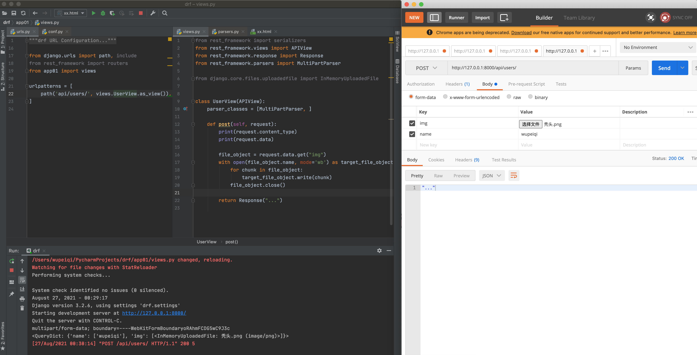
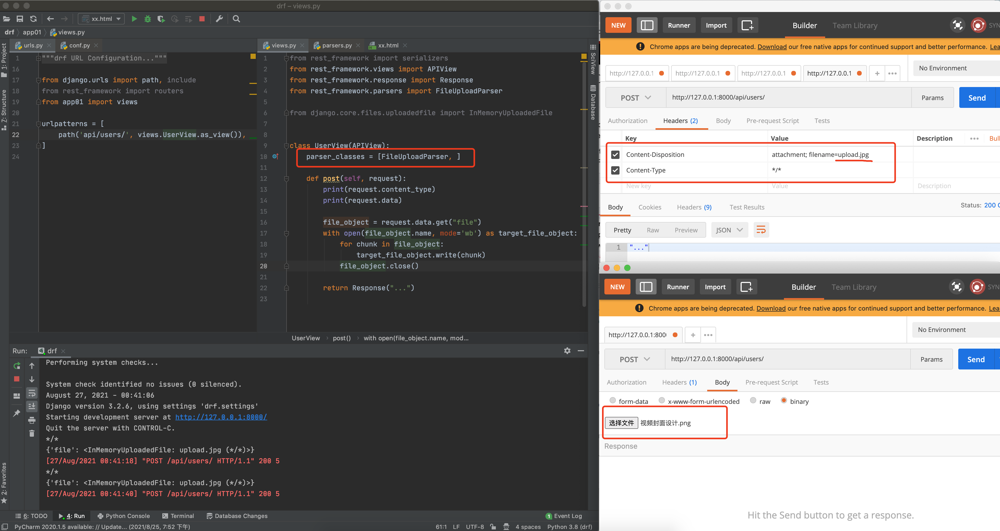

# DjangoRestframework

- 项目部署

- 前后端分离

  - 程序角度：1个django程序，接收请求+处理+HTML模板+用户返回
  - 2个程序
    - 前端：vue.js/react.js/angular.js
    - 后端：django + django restframework

  - 专业度角度：
    - 前端 前端代码 + 部署 + 版本管理 + ajax请求获取
    - 后端 API 

  

APP 或 微信小程序

- 前端：APP或微信小程序
- 后端：API


## Restframework


### 官方文档

[Home - Django REST framework (django-rest-framework.org)](https://www.django-rest-framework.org/)


### 安装

```bash
pip install djangorestframework
```

### 注册

settings.py

```python
INSTALLED_APPS = [
    "rest_framework"
]
```


## 接口调试工具

postman

apifox


## 初步编写API

- 基于django实现

- 基于drf实现

  

### 路由

```python
path('auth/', views.auth),
```


### 视图

```python
def auth(request):
    return JsonResponse({'status': True, 'message': "success"})
```


## FBV 和 CBV

- 现象
- 本质相同


**POST请求 免除CSRF token校验**

```python
@csrf_exempt
def info(request):
	pass
```


## CBV -> (DRF) -> dispath

```python
path('user/<int:pk>', views.UserView.as_view())

def get(self, request, pk):
```

- 请求对象和参数

  django的request对象

  ​	request.method

  ​	request.GET

  ​	request.POST

​	drf 中的 request 参数，又一层封装

​			# request._request.GET

​			# request._request.POST

​			# request._request.method

​	class Request:

​			def \__init__(self, request,......):

​					self._request = request

​					self.....


## 前后端分离

- 不分离
  - 后台系统 & 用户量少
- 前后端分离
  - 用户系统 & 专业分工


## restframework匿名用户报错

> django 纯净版

```python
# 源码 restframework request.py 中 
def _not_authenticated(self):
    if api_settings.UNAUTHENTICATED_USER:
        self.user = api_settings.UNAUTHENTICATED_USER()
    else:
        self.user = None
```

> 解决

settings.py

```python
REST_FRAMEWORK = {
    "UNAUTHENTICATED_USER": None,
    # "UNAUTHENTICATED_TOKEN": None,
}

```


## Request 对象

- OOP知识

```python
对象的封装
class Foo(object):
    def __init__(self, name, age):
        self.name = name
        self.age = age
        
    # 当通过对象访问一个不存在的东西，getattr会执行
    def __getattr__(self, item):
        print(item)
		return 123
    
    # 只要执行 对象.xxx都会执行 __getattribute__
    # 对象中有值，返回
    # 对象中没有值，报错
    def __getattribute__(self, item):
        print("-->", item)
        return 999
    
    # drf中request方法
    # 对象中有的成员，不会触发
    # 对象中无的成员，会触发
    def __getattr__(self, attr):
        # attr = "yyy"
        try:
            return getattr(self._request, attr) # self._request.yyy
        except AttributeError:
            return self.__getattribute__(attr)
```


- drf请求流程
  - *args, **kwargs


## 认证组件

- 用户授权
  - 无需登录访问
  - 登录才能访问
  - 实现
    - 编写类 —> 认证组件
    - 应用组件


全局配置用户授权

```python
REST_FRAMEWORK = {
    "DEFAULT_AUTHENTICATION_CLASSES":["app名称.views.类名"]
}
```


- 面向对象-继承

  ```python
  class APIView(object):
      authentication_classes = 读取配置文件中的列表
      
      def dispatch(self):
          self.authentication_classes
  
  class UserView(APIView):
      authentication_classes = [11,22,33,44]
          
  obj = UserView()
  obj.dispatch()
  ```

  

- 认证组件源码
  - 加载认证组件，本质就是实例化每个认证类的对象，并封装到request对象。

- 多个认证类
  - 都返回None，都没有认证成功 -> 视图函数会执行，只不过 self.user  self.auth = None


- 状态码

```python
class MyAuthentication(BaseAuthentication):

    def authenticate_header(self, request):
        return "API"
```


- 扩展 -> 子类的约束

```python
class Foo(object):
    # 对子类进行约束，约束子类中必须要定义这个方法。（接口、抽象类和抽象方法）
    def f1(self):
        raise NotImplementedError("...")
```


## 权限组件

认证组件 = [认证类、认证类、认证类]  -> 执行每个认证类中的authenticate方法

权限组件 = [权限类、权限类、权限类...] -> 执行每个权限类中的has_permission方法  执行所有的权限类

默认情况下，保证所有的权限类中的has_permission方法都返回True


**源码**

```python
class APIView(View):
    def initial(self, request, *args, **kwargs):
        self.perform_authentication(request) # 认证组件的过程，循环执行每个authticate方法，失败抛出异常：request.user/auth
        self.check_permissions(request) # 权限的校验
        self.check_throttles(request)
```


应用

- 类
- 应用（局部+全局应用）


应用场景

- 经典角色、当前订单是他的下属创建的


**drf中的认证、权限组件 与 Django中的中间件有什么关系？**

```python
# 先经过中间件 然后进行认证、权限组件
# 闭包中的view(免除csrf)
1.创建CBV的视图对象
2.执行对象dispatch
	2.1请求封装
    2.2认证
    2.3权限处理
```


## 限流

某个接口不想让用户访问过于频繁，限流机制。例如：手机号限制、平台请求、iP

限制访问频率：

- 已登录用户，用户信息主键、ID、用户名
- IP为唯一标识 + 算法JS

如何限制？

- 一定时间内，访问次数
- 获取当前时间
- 当前时间 - 10分钟 = 计数开始时间
- 计算长度
  - 超过，错误
  - 未超，访问


使用：

- 编写类
  - 编写类
  - 安装 django-redis配置 -> settings.py
  - 安装 django-redis
  - 启动redis服务
- 应用类
  - 局部应用


源码和具体实现：

- 对象加载
  - 获取每个限流类的对象，初始化（读取限制的配置，获取到 时间间隔 + 访问次数）--> num_requests, duration
- allow_request是否限流


### 案例：用户登录+用户认证+角色+扩展案例+限流

- 无需登录，限流  1分钟 10次


限流自定义错误提示

拆分知识点

- getattr
- getatrribute
- 继承

request 封装 + 认证 + 权限 + 限流 => 文章 + 流程图

<<<<<<< HEAD


## 解析器

解析请求者发送过来的数据 JSON

1. 读取请求头
2. 根据请求头解析数据
   1. 根据请求头获取解析器
   2. request.data = JSON解析器.parse
3. request.data


**json.loads 与 json.load 区别**

```python
data_dict = json.loads('{"v1":123, "v2":345}')

data_dict = json.load(文件对象)
```


###  JSONParser （*）


### FormParser


### MultiPartParser（*）



```html
<!DOCTYPE html>
<html lang="en">
<head>
    <meta charset="UTF-8">
    <title>Title</title>
</head>
<body>
<form action="http://127.0.0.1:8000/test/" method="post" enctype="multipart/form-data">
    <input type="text" name="user" />
    <input type="file" name="img">

    <input type="submit" value="提交">

</form>
</body>
</html>
```


### FileUploadParser（*）



解析器可以设置多个，默认解析器：

```python
from rest_framework.views import APIView
from rest_framework.response import Response
from rest_framework.parsers import MultiPartParser, JSONParser, FormParser

class UserView(APIView):

    def post(self, request):
        print(request.content_type)
        print(request.data)

        return Response("...")

```

 

### 数据

文件二进制读取

- Tempa 对象
- Tempa 对象 -> 临时文件


## 元类

```python
# 创建类：方式2
# 类名 = type("类名", (父类,), {成员})
Foo = type("Foo", (object,), {"v1":123, "func": lamba self: 999})
```

- 基于类可以实例化对象。

- type也可以创建类。

  - 默认 type

    ```python
    class type:
        def __init__(self):
            在空值初始化数据
        def __new__(self):
            创建->创建类
    ```

  - 自定义 继承type

    ```python
    class MyType(type):
        def __new__(self):
            super().__new__()
    ```

- 如何基于MyType创建类呢？

  
  
- 类中获取父类中指定了metaclass，全部都是有metaclass创建的类

  


## 序列化器

### 序列化数据

#### Serializer

```python
from django.db import models


class Role(models.Model):
    title = models.CharField(verbose_name="标题", max_length=32)
    order = models.IntegerField(verbose_name="顺序")
```

```python
from rest_framework.views import APIView
from rest_framework.response import Response
from rest_framework import serializers
from api import models


class InfoSerializer(serializers.Serializer):
    id = serializers.IntegerField()
    title = serializers.CharField()
    order = serializers.IntegerField()


class InfoView(APIView):
    def get(self, request):
        # 1.数据库获取多条数据
        # queryset = models.Role.objects.all()
        # ser = InfoSerializer(instance=queryset, many=True)

        # 2.数据库获取单条数据
        instance = models.Role.objects.all().first()
        ser = InfoSerializer(instance=instance, many=False)
        
        print(type(ser.data), ser.data)
        return Response(ser.data)

```


#### ModelSerializer

```python
from django.db import models


class Role(models.Model):
    title = models.CharField(verbose_name="标题", max_length=32)
    order = models.IntegerField(verbose_name="顺序")
```

```python
from rest_framework.views import APIView
from rest_framework.response import Response
from rest_framework import serializers
from api import models


class InfoSerializer(serializers.ModelSerializer):
    class Meta:
        model = models.Role
        # fields = "__all__"
        # fields = ['id', 'title', 'order']
        exclude = ["id"]


class InfoView(APIView):
    def get(self, request):
        # 1.数据库获取多条数据
        # queryset = models.Role.objects.all()
        # ser = InfoSerializer(instance=queryset, many=True)

        # 2.数据库获取单条数据
        instance = models.Role.objects.all().first()
        ser = InfoSerializer(instance=instance, many=False)

        print(type(ser.data), ser.data)
        return Response(ser.data)
```

很显然，如果要对数据表中的字段进行序列化，使用ModelModelSerializer是要比Serializer更简洁一些的。


